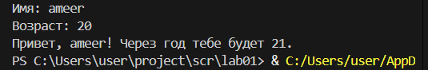
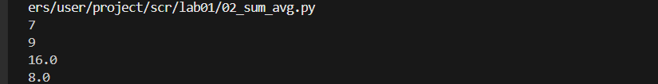
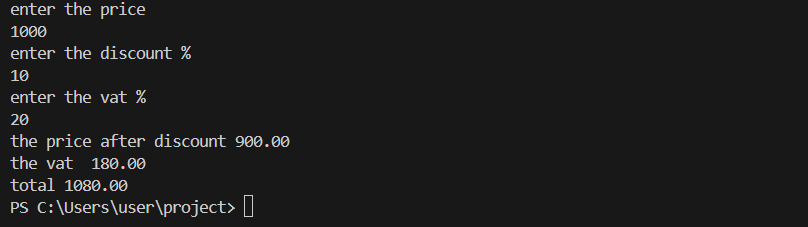
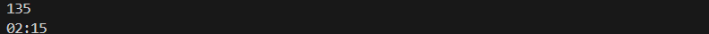

## lab01

### ex01

```python
name = input('Имя: ')
age = int(input('Возраст: '))
print(f'Привет, {name}! Через год тебе будет {age+1}.')
```




### ex02

```python
numbers = [float(input()),float(input())]
total = sum(numbers)
average = sum(numbers) / len(numbers)
print(total)
print(average)
```




### ex03

```python
print("enter the price")
price = float(input())
print("enter the discount %")
discount = float(input())
print("enter the vat % ")
vat = float(input())
base = price * (1-discount/100)
vat_amount  = base * (vat/100)
total = base + vat_amount
print("the price after discount",f"{base:.2f}")
print("the vat ", f"{vat_amount:.2f}")
print("total", f"{total:.2f}")
```




## ex04

```python
minutes = int(input())
hh = minutes // 60
mm = minutes % 60
if hh <= 24 :
    print(f"{hh:02d}",f"{mm:02d}",sep=":")
else :
    print("none")
```

