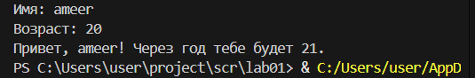
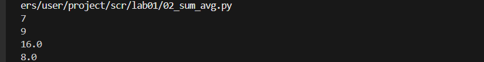
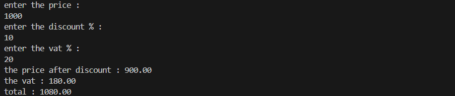
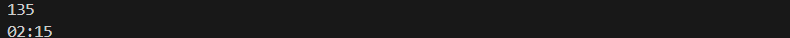
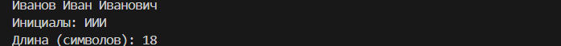
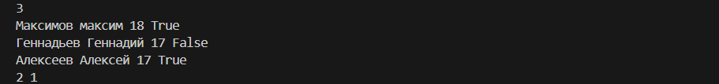

## lab01

### ex01

```python
name = input('Имя: ')
age = int(input('Возраст: '))
print(f'Привет, {name}! Через год тебе будет {age+1}.')
```




### ex02

```python
numbers = [float(input()),float(input())]
total = sum(numbers)
average = sum(numbers) / len(numbers)
print(total)
print(average)
```




### ex03

```python
print("enter the price :")
price = float(input())
print("enter the discount % :")
discount = float(input())
print("enter the vat % :")
vat = float(input())
base = price * (1-discount/100)
vat_amount  = base * (vat/100)
total = base + vat_amount
print("the price after discount",f"{base:.2f}")
print("the vat ", f"{vat_amount:.2f}")
print("total", f"{total:.2f}")
```




## ex04

```python
minutes = int(input())
hh = minutes // 60
mm = minutes % 60
if hh <= 24 :
    print(f"{hh:02d}",f"{mm:02d}",sep=":")
else :
    print("none")
```




## ex05

```python
ФИО = input()
length1 = len(ФИО.replace(" ", ""))
def get_first_letters(name) :
    words = name.split()
    first_letters = [word[0] for word in words if word]
    return ''.join(first_letters)
print("Инициалы:",get_first_letters(ФИО))
print("Длина (символов):", length1)
```




## ex06

```python
n = int(input())

on_campus = 0
online = 0

for _ in range(n):
    line = input().split()

    format_type = line[-1]
    
    if format_type == "True":
        on_campus += 1
    else :
        online += 1

print(on_campus, online)
```

 


 ## lab02

 ## ex01

 ```python
 def min_max(sequence):
    if not isinstance(sequence, (list, tuple)):
        raise TypeError(f"{sequence} is not list or tuple")
    
    if len(sequence) == 0:
        raise ValueError("Sequence cannot be empty")
    
    min_val = sequence[0]
    max_val = sequence[0]
    
    for element in sequence:
        if element < min_val:
            min_val = element
        if element > max_val:
            max_val = element
    
    return (min_val, max_val)


def unique_sorted(sequence):
    if not isinstance(sequence, (list, tuple)):
        raise TypeError(f"{sequence} is not list or tuple")
    unique_elements = set(sequence)
    return sorted(unique_elements)


def flatten(matrix):
    if not isinstance(matrix, (list, tuple)):
        raise TypeError(f"{matrix} is not list or tuple")
    
    result = []
    
    for row in matrix:
        if not isinstance(row, (list, tuple)):
            raise TypeError(f"{row} is not list or tuple")
        
        for element in row:
            result.append(element)
    
    return result


print("=== min_max ===")
print(min_max([3, -1, 5, 5, 0]))
print(min_max([42]))
print(min_max([-5, -2, -9]))
try:
    print(min_max([]))
except ValueError as e:
    print("Error:", e)
print(min_max([1.5, 2, 2.0, -3.1]))

print("\n=== unique_sorted ===")
print(unique_sorted([3, 1, 2, 2, 3]))
print(unique_sorted([]))
print(unique_sorted([-1, -1, 0, 2, 2]))
print(unique_sorted([1.0, 1, 2.5, 2.5, 0]))

print("\n=== flatten ===")
print(flatten([[1, 2], [3, 4]]))
print(flatten([[1, 2], [3, 4, 5]]))
print(flatten([[1], [], [2, 3]]))
try:
    print(flatten([[1, 2], "ab"]))
except TypeError as e:
    print("Error:", e)
```

.png)


## ex02

```python
def transpose(mat):
    if not isinstance(mat, list):
        raise TypeError("Input must be a list")
    
    if len(mat) == 0:
        return []
    
    row_length = len(mat[0])
    for row in mat:
        if not isinstance(row, list):
            raise TypeError("All elements must be lists")
        if len(row) != row_length:
            raise ValueError("Jagged matrix is not allowed")
    
    transposed = []
    for col_index in range(len(mat[0])):
        new_row = []
        for row_index in range(len(mat)):
            new_row.append(mat[row_index][col_index])
        transposed.append(new_row)
    
    return transposed


def row_sums(mat):
    if not isinstance(mat, list):
        raise TypeError("Input must be a list")
    
    if len(mat) == 0:
        return []
    
    row_length = len(mat[0])
    for row in mat:
        if not isinstance(row, list):
            raise TypeError("All elements must be lists")
        if len(row) != row_length:
            raise ValueError("Jagged matrix is not allowed")
    
    sums = []
    for row in mat:
        row_sum = 0
        for element in row:
            row_sum += element
        sums.append(row_sum)
    
    return sums


def col_sums(mat):
    if not isinstance(mat, list):
        raise TypeError("Input must be a list")
    
    if len(mat) == 0:
        return []
    
    row_length = len(mat[0])
    for row in mat:
        if not isinstance(row, list):
            raise TypeError("All elements must be lists")
        if len(row) != row_length:
            raise ValueError("Jagged matrix is not allowed")
    
    sums = []
    for col_index in range(len(mat[0])):
        col_sum = 0
        for row_index in range(len(mat)):
            col_sum += mat[row_index][col_index]
        sums.append(col_sum)
    
    return sums

print("=== transpose ===")
print(transpose([[1, 2, 3]]))
print(transpose([[1], [2], [3]]))
print(transpose([[1, 2], [3, 4]]))
print(transpose([]))
try:
    print(transpose([[1, 2], [3]]))
except ValueError as e:
    print("Error:", e)
    
print("\n=== row_sums ===")
print(row_sums([[1, 2, 3], [4, 5, 6]]))
print(row_sums([[-1, 1], [10, -10]]))
print(row_sums([[0, 0], [0, 0]]))
try:
    print(row_sums([[1, 2], [3]]))
except ValueError as e:
    print("Error:", e)
    
print("\n=== col_sums ===")
print(col_sums([[1, 2, 3], [4, 5, 6]]))
print(col_sums([[-1, 1], [10, -10]]))
print(col_sums([[0, 0], [0, 0]]))
try:
    print(col_sums([[1, 2], [3]]))
except ValueError as e:
    print("Error:", e)
```

.png)


## ex03

```python
def format_record(rec):
    if not isinstance(rec, tuple):
        raise TypeError("Input must be a tuple")
    
    if len(rec) != 3:
        raise ValueError("Tuple must have exactly 3 elements")
    
    ФИО, group, gpa = rec
    
    if not isinstance(ФИО, str):
        raise TypeError("ФИО must be a string")
    if not isinstance(group, str):
        raise TypeError("Group must be a string")
    if not isinstance(gpa, (int, float)):
        raise TypeError("GPA must be a number")
    
    ФИО = ФИО.strip()
    if not ФИО:
        raise ValueError("ФИО cannot be empty")
    
    group = group.strip()
    if not group:
        raise ValueError("Group cannot be empty")
    
    if gpa < 0:
        raise ValueError("GPA cannot be negative")
    
    names = [name.strip() for name in ФИО.split() if name.strip()]
    
    if len(names) < 2:
        raise ValueError("ФИО must contain at least last name and first name")
    
    last_name = names[0]
    first_names = names[1:]
    
    initials = '.'.join(name[0].upper() for name in first_names) + '.'
    
    formatted_gpa = f"{gpa:.2f}"
    
    result = f"{last_name} {initials}, гр. {group}, GPA {formatted_gpa}"
    
    return result


print("=== format_record ===")
    
print(format_record(("Иванов Иван Иванович", "БИВТ-25", 4.6)))
    
print(format_record(("Петров Пётр", "IKB0-12", 5.0)))
    
print(format_record(("Петров Пётр Петрович", "IKB0-12", 5.0)))
    
print(format_record(("Сидорова анна аергеевна", "АВВ-01", 3.999)))
    
try:
    print(format_record(("", "БИВТ-25", 4.5)))
except ValueError as e:
    print("Error:", e)
    
try:
    print(format_record(("Иванов", "БИВТ-25", 4.5)))
except ValueError as e:
    print("Error:", e)
    
try:
    print(format_record(("Иванов Иван", "", 4.5)))
except ValueError as e:
    print("Error:", e)
    
try:
    print(format_record(("Иванов Иван", "БИВТ-25", -1.0)))
except ValueError as e:
    print("Error:", e)


```
.png)


